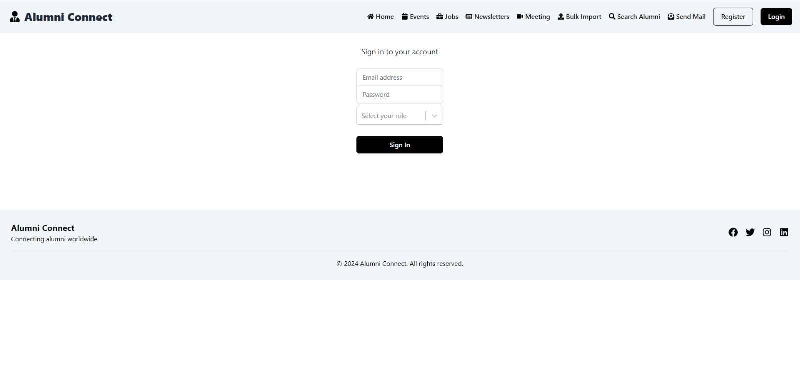

# 🎓 AlumniHub

🚀 A MERN stack alumni networking platform with job postings, event management, resume uploads, real-time chat, and admin controls.

---

## ✨ Features

- 👥 Alumni Verification & Authentication  
- 📅 Create & Manage Events  
- 💼 Post & View Jobs  
- 📧 Send Targeted Emails  
- 📂 Upload & View Resumes  
- 📰 Publish Newsletters  
- 💬 Real-Time Chat Rooms  
- 📊 Analytics Dashboard  
- 🧑‍🏫 Faculty Management  
- 🔍 Advanced Search & Filter  
- 🎟️ Support Ticket System  

---

## 🛠️ Tech Stack

- ⚛️ React.js  
- 🟢 Node.js  
- 🚂 Express.js  
- 🍃 MongoDB  
- 🔌 Socket.IO  

---

## ⚙️ Installation

### 📌 Frontend

```bash
cd Frontend
npm install
npm run dev
```

### 📌 Backend

```bash
cd Backend
npm install
npm start
```

---

## 📸 Screenshots



---

## 👨‍💻 Author

**Sahil Ali**
//**Syed Kumail Rizvi**
